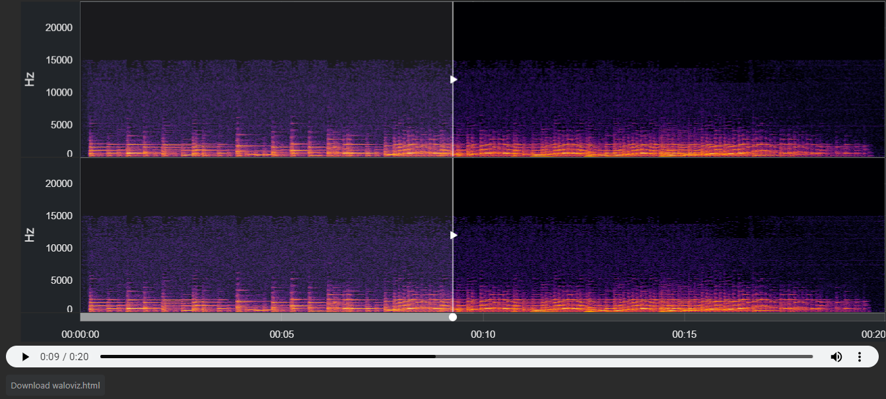

# waloviz

A (soon to be) open source interactive spectrogram audio player, primarily based on bokeh and the holoviz stack (wav+holoviz=waloviz).
## How to use?
In jupyter\jupyterlab:
```python
import waloviz as wv
wv.extension()
wv.Audio('http://ccrma.stanford.edu/~jos/mp3/pno-cs.mp3')
```
I am actively working on making this project open source, and a pip package etc, some really exciting stuff :)  
## A VERY initial Roadmap
 - [ ] reserve domains\handles\etc.
 - [ ] become open source
 - [ ] make the repo welcoming for users and contributors
 - [ ] make a github actions CI/CD pipeline
 - [ ] publish a test package
 - [ ] make sure that everything works OOTB
 - [ ] publish an alpha package
 - [ ] make sure that everything works again
 - [ ] create a documentation website with an interactive example
 - [ ] document everything
 - [ ] go through every link and make sure it works properly
 - [ ] create known issues
 - [ ] create a more advanced roadmap
 - [ ] launch the package on social media
