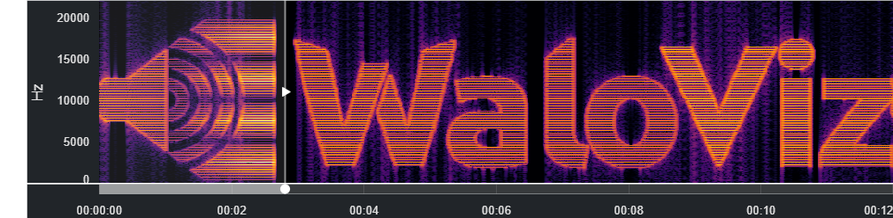
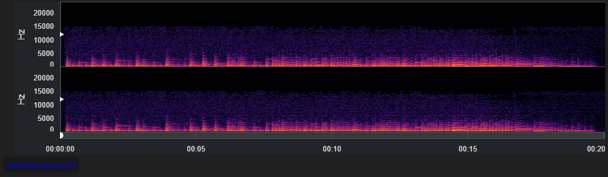

<h1></h1>

[](https://opensource.org/licenses/MIT)
[](code_of_conduct.md)
[](https://github.com/AlonKellner/waloviz/actions/workflows/ui-tests.yml)
[](https://waloviz.com/en/latest)  
[](https://pypi.python.org/pypi/waloviz/)
[](https://pepy.tech/project/waloviz)
[](https://pepy.tech/project/waloviz)
[](https://pypi.python.org/pypi/waloviz/)

[](https://waloviz.com)
**An open source interactive audio player with a spectrogram built-in, primarily based on [Bokeh](https://bokeh.org/) and the [HoloViz](https://holoviz.org/) stack (wav+HoloViz=WaloViz).**

## Installation

```shell
pip install waloviz
apt-get install ffmpeg
```

## Quickstart

In a notebook cell:

```python
import waloviz as wv
wv.extension()
wv.Audio('http://ccrma.stanford.edu/~jos/mp3/pno-cs.mp3')
```



To learn more read our [Getting Started Guide](https://waloviz.com/en/latest/getting-started.html) :)

## [Documentation](https://waloviz.com)

[Our Docs](https://waloviz.com) are generated by [Sphinx](https://www.sphinx-doc.org/en/master/) and [NBSite](https://nbsite.holoviz.org/) and hosted by [Read the Docs](https://docs.readthedocs.io/en/stable/).  
You can also try `waloviz` right now with our [Google Colab Demo](https://colab.research.google.com/drive/1euQCxaNlTg0pGvXz6d7RSoDhM3B1k7dy?usp=sharing) :)

## [Contributing](CONTRIBUTING.md)

WaloViz is a beginner friendly open-source project!  
To make a contirbution, please read our [Contributing Guide](CONTRIBUTING.md).

## Our Vision

WaloViz has only two long term goals:

### **Be the Definitive Go-To Visualization Tool for Audio Research Experts**

First by being Simple to Use, and secondly by having Powerful Features.

### **Grow a Healthy Open-Source Community**

By being Responsive to Users, and Welcoming to Beginner Conftributors.

## Roadmap

- [ ] Early Alpha release
- [ ] Create and follow dependencies Issues
- [ ] Create a PR for the [Panel Community Gallery](https://panel.holoviz.org/gallery/index.html#community-gallery)
- [ ] Plan Beta release features
- [ ] Extensive UI Tests (with playwright, see [tests/ui/sanity_test.py](tests/ui/sanity_test.py))
- [ ] Prepare Beta release
- [ ] Write Medium article for Beta launch
- [ ] Beta release
- [ ] Plan 1.0 release features
- [ ] Prepare 1.0 release
- [ ] 1.0 release
